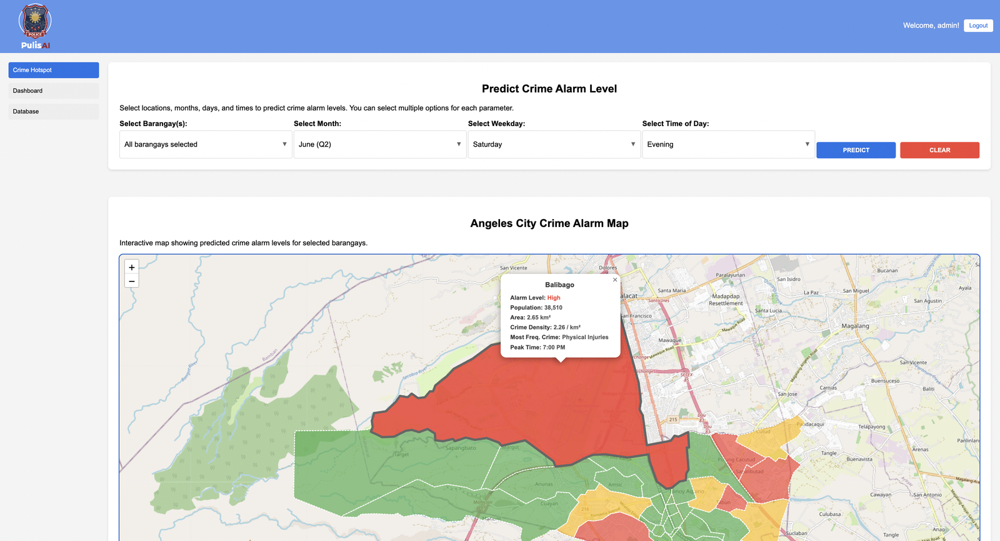
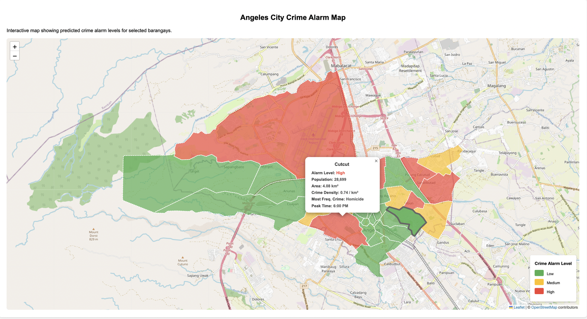
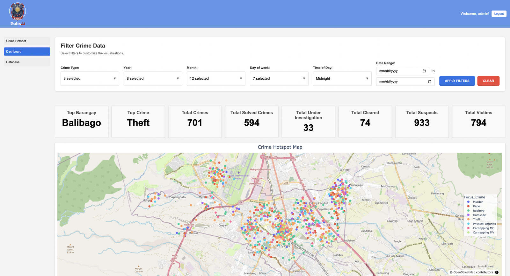
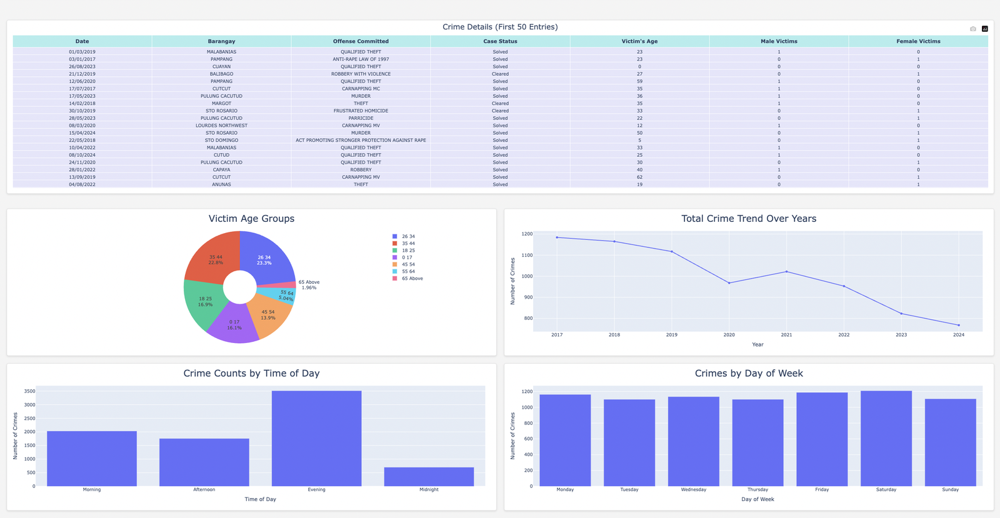
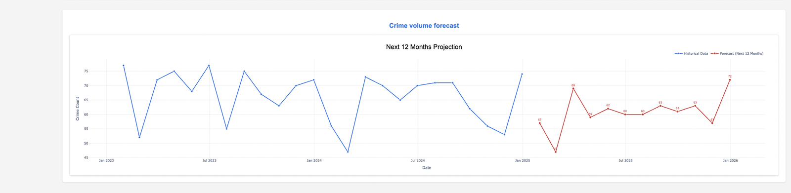

# PulisAI — Crime Hotspot and Pattern Analysis

A Flask web application that classifies crime risk across the 33 barangays of
Angeles City, Philippines, and visualises historical incident patterns. Built as
an undergraduate thesis for the Angeles City Police Office and published in the
*International Journal of Computer Applications*.

**Paper:** [10.5120/ijca53573a50813e](https://doi.org/10.5120/ijca53573a50813e)
· IJCA 187(98), April 2026, pp. 39–46

> **The incident data in this repository is synthetic.** Every crime record is
> generated by [`generate_data.py`](generate_data.py). The real dataset came from
> the Angeles City Police Office under a confidentiality agreement and is not
> distributable — it is not in this repository in any form, and neither is any
> model trained on it. Barangay boundaries and census figures are real, because
> both are public record. See [Real vs. synthetic](#real-vs-synthetic).

---

## Screenshots

All views below run on synthetic data generated by `generate_data.py`.

**Crime hotspot prediction.** Alarm levels for the selected barangays, rendered
as a Leaflet choropleth over real barangay boundaries. Green Low, amber Medium,
red High; unselected barangays stay grey.



**Barangay detail.** Clicking a barangay gives its population, land area, crime
density per km2, most frequent offense and peak hour.



**Analytics dashboard.** Eight metric tiles and an incident scatter map, driven
by six filter dimensions: crime type, year, month, weekday, time of day and
date range.



**Linked dashboard views.** The same filter state drives a table of matching
records, victim age distribution, year-over-year trend, and breakdowns by time
of day and day of week.



**Twelve-month forecast.** A separate XGBoost regressor over monthly resampled
counts, using a twelve-month lag, per-month historical averages and a linear
time index.



---

## Quickstart

```bash
pip install -r requirements.txt
python generate_data.py      # writes data/focus_df.csv
python xgboost_model.py      # trains the classifier on it
python app.py                # http://127.0.0.1:5000
```

Log in with `admin` / `pulisai`, or set your own:

```bash
export PULISAI_USER=you PULISAI_PASSWORD=something
export PULISAI_SECRET_KEY=$(python -c "import secrets;print(secrets.token_hex(32))")
```

**[USAGE.md](USAGE.md) covers each page in detail** — making predictions,
reading the map, filtering the dashboard, and the upload-and-retrain workflow.

## What it does

**Crime hotspot prediction.** Pick a barangay, month, weekday and six-hour time
band; the model returns a Low / Medium / High alarm level, rendered as a Leaflet
choropleth over real barangay boundaries. Clicking a barangay shows its
population, area, crime density, most frequent offense and peak hour.

**Analytics dashboard.** Filters the incident set across six dimensions — crime
type, year, month, weekday, time of day, date range — driving linked Plotly
views for case status, victim demographics, temporal distribution and
year-over-year trend.

**Twelve-month forecast.** A separate XGBoost regressor over monthly resampled
counts, using a twelve-month lag, per-month historical averages and a linear
time index.

**Upload and retrain.** Police staff can upload new incident, suspect and victim
CSVs; the app runs them through the full pipeline, merges with history,
recomputes the alarm thresholds and refits the model without developer
involvement.

## How the model works

The unit is not the incident, it is the **spatio-temporal block**: one barangay,
one month, one weekday, one six-hour band. Incidents within a block are counted,
and the count is quantile-binned into three alarm levels. That framing is what
makes the output actionable — "theft is likely in this barangay" is not a patrol
assignment, "this barangay, Friday evenings in March" is.

Seven features are used, deliberately excluding the count itself: population,
land area, police stations within 1 km, weekend ratio, average hour, and median
victim and suspect counts.

The paper benchmarked four algorithms with and without SMOTE oversampling.
XGBoost without SMOTE was selected, reaching **92.69% accuracy, 87% macro-F1 and
82% UAR** against Random Forest (88.65%), SVC (79.47%) and multinomial logistic
regression (52.57%). Because most blocks are Low, accuracy alone overstates
performance; macro-F1 and unweighted average recall are the metrics that move.

**The numbers this repository prints are not those numbers.** They come from
generated data and will change with `--seed`.

## Real vs. synthetic

| | Source |
|---|---|
| Barangay names and boundaries | Real — public Philippine administrative boundary data |
| Population, land area, density | Real — Philippine Statistics Authority census |
| Police station coordinates | Real — public locations |
| **Every crime incident** | **Synthetic** — dates, times, offenses, coordinates, case outcomes, suspect and victim demographics all generated |

```bash
python generate_data.py --seed 7 --records 15000
```

## Layout

```
app.py               Flask application: routes, prediction, forecasting, upload
data_processor.py    ETL: cleaning, imputation, geospatial features, joins
xgboost_model.py     Training: aggregation, alarm thresholds, model fit
generate_data.py     Synthetic incident generator
templates/           Jinja2 views
static/              CSS and images
*.ipynb              Research notebooks: data preparation, model comparison
```

## Built with

Python · Flask · Jinja2 · XGBoost · scikit-learn · pandas · Plotly · Leaflet.js
· geopy

## Context

Four-person undergraduate thesis at Angeles University Foundation. I led the
team and was first author on the paper. The deployed system was validated with
Angeles City Police Office personnel against ISO 25010, scoring 4.93/5.
